# 🕋 Al Quran - القرآن الكريم

  

  

  

This is a full-fledged Android application that I architected and developed **completely from scratch in Java** during my time at **Zeesoft Tech**. 

The app serves as a comprehensive spiritual companion and daily Islamic utility. It combines the complete sacred text of the Holy Quran with high-quality audio recitations, multilingual translations, highly accurate prayer times, and interactive tools like a Qibla compass and digital Tasbeeh counter.

With **over 50,000+ active downloads** on the Google Play Store, this app provides millions of users worldwide with an elegant, stable, and offline-ready resource for their daily prayers and spiritual growth.

## 👨‍💻 My Role & Contributions

As the **Lead Android Developer**, I solely designed, architected, and developed this entire project from the ground up using **Java**. My key technical contributions included:

* **🏗️ Ground-up Java Architecture:** Designed and built the entire application architecture from scratch using Java, ensuring high-performance database management for offline reading and low-latency audio streaming.
* **🗺️ Multilingual Translation System:** Engineered a dynamic content delivery network inside the app to handle Quranic translations in over 15+ major global languages, keeping the database footprint highly optimized.
* **🎙️ Audio Streaming & Media Player:** Developed a robust background audio streaming player to play high-quality Quranic recitations by renowned Qaris, supporting background playback, playback controls, and offline downloads.
* **🧭 Location-Based Prayer & Qibla Engine:** Programmed precise GPS-based calculation algorithms to display accurate prayer times and locate the correct Qibla direction dynamically from any location worldwide.

## 🔒 Code Sharing & Intellectual Property Notice

Because this app is actively published and holds proprietary commercial value, **the source code cannot be shared publicly** due to my confidentiality agreement with **Zeesoft Tech**. 

This repository is created solely to showcase:
* The design and user interface of the app.
* The features and user workflows.
* The clean Java programming and product architecture.

## 🚀 Key Features

### 📖 Holy Quran with Multilingual Translations
* **Native Reading Layout:** High-resolution Quranic pages with clean, distraction-free typography.
* **Global Translations:** Direct access to translations in English, Urdu, French, German, Spanish, Turkish, Bengali, Hindi, Chinese, and many more.

### 🎙️ Audio Recitations by Renowned Qaris
* **Melodious Playback:** High-fidelity recitations from famous Qaris, including Sheikh Al-Sudais, Mishary Al-Afasy, Abdul Basit, and Sheikh Husary, with background playback support.

### 🕋 Prayer Timings & Qibla Compass
* **GPS Calculation:** Highly accurate, location-aware prayer alerts.
* **Qibla Finder:** A precise sensor-based compass pointing directly toward the Qibla from anywhere in the world.

### 📿 Digital Tasbeeh Counter & Daily Azkars
* **Remembrance Counter:** A customizable digital counter with pre-loaded supplications, Allah's names, and audio Azkars to support daily remembrance.

### 📝 Islamic Knowledge & Utilities
* **Kalmas & Sajda Verses:** Learn the 6 Kalmas with translation and audio, alongside detailed markers for prostration (Sajda) verses in the Quran.
* **Islamic Hijri Calendar:** Easy navigation to track important Islamic dates, including Eid, Hajj, and the Islamic New Year.

## 📱 App Screenshots

Here is a look at the final Quran reading layouts, Qibla compass screens, and daily prayer timing interfaces that I built:

  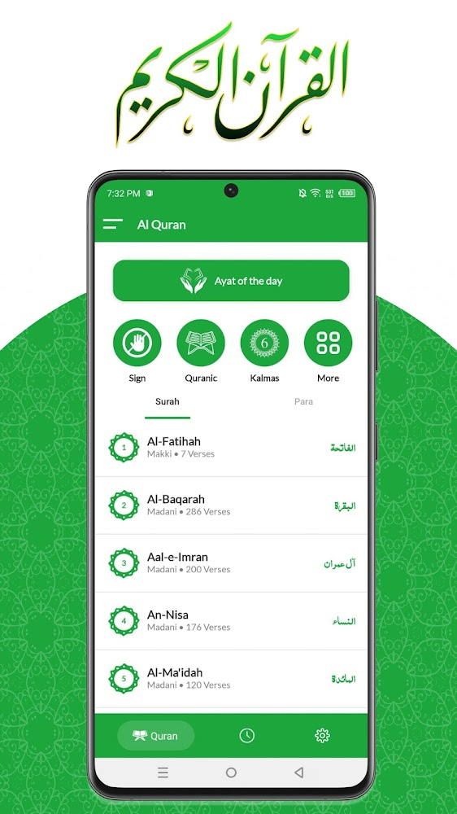
  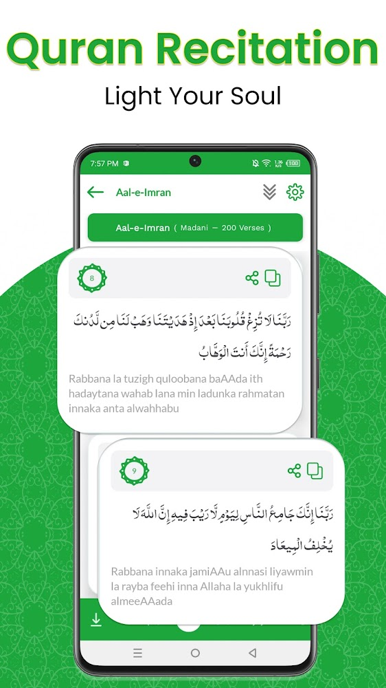
  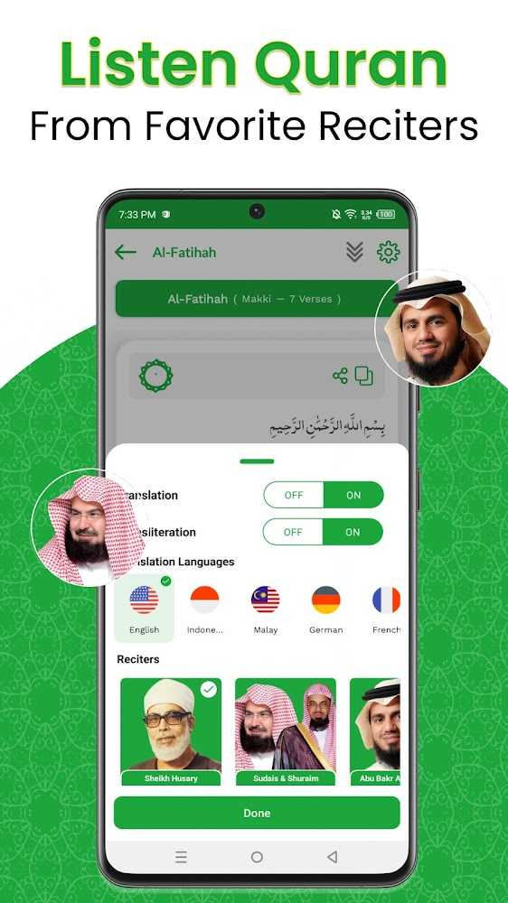

  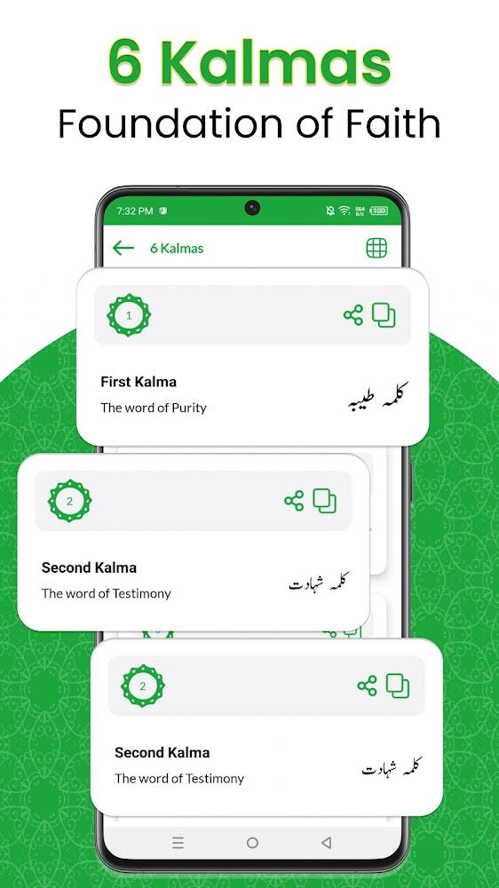
  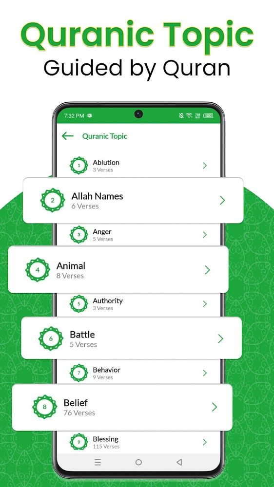
  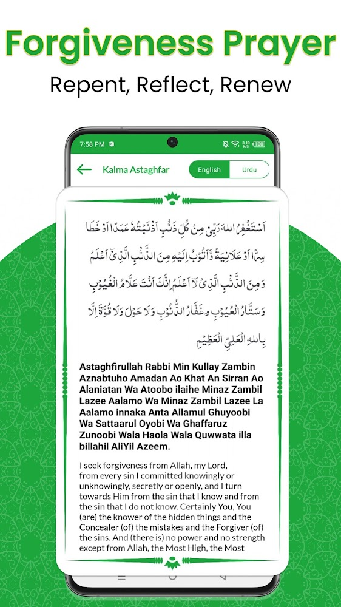

  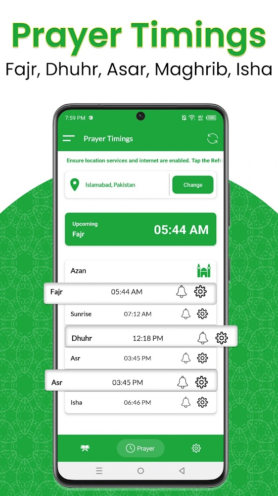
  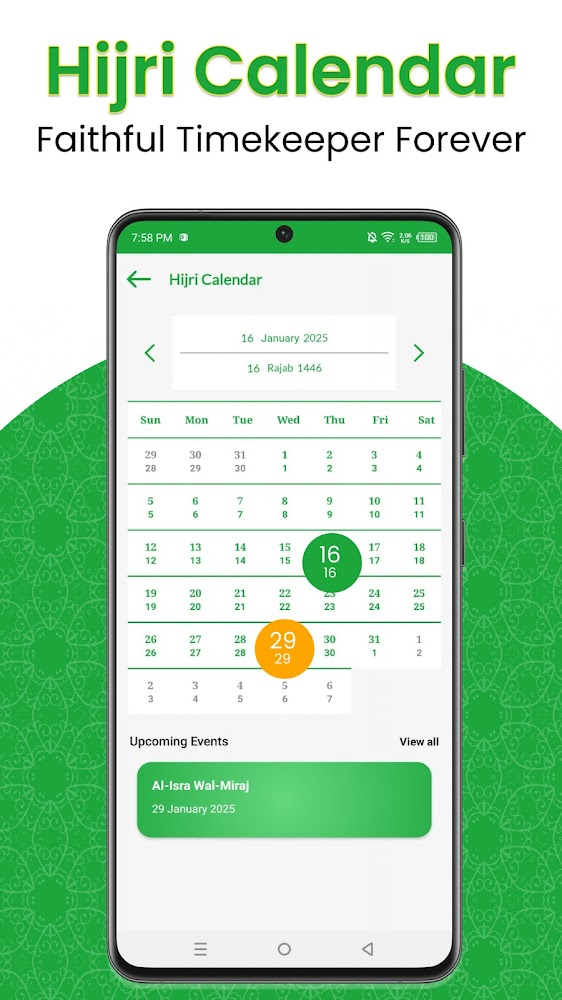
  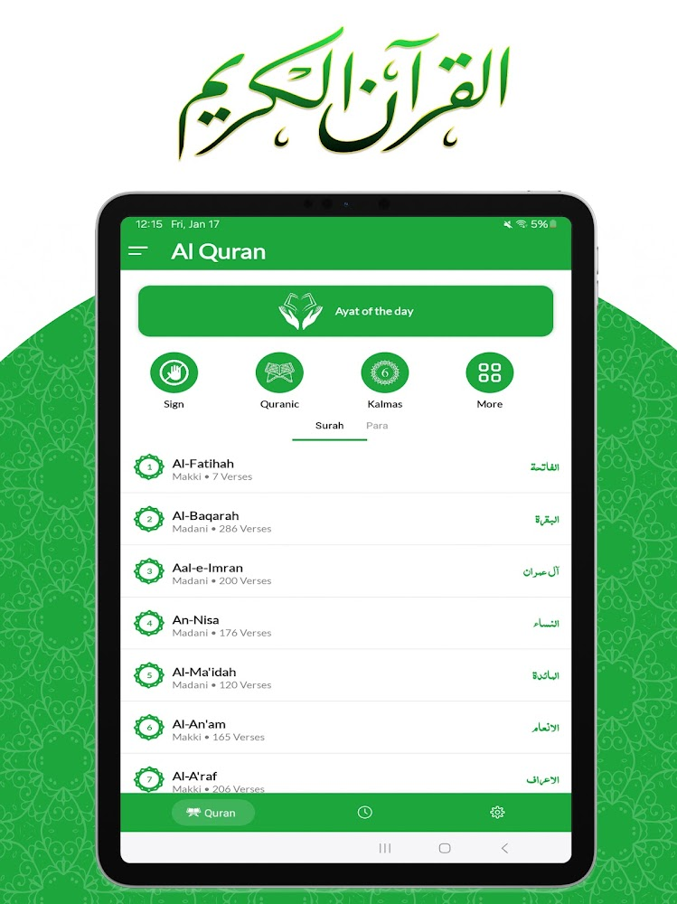

  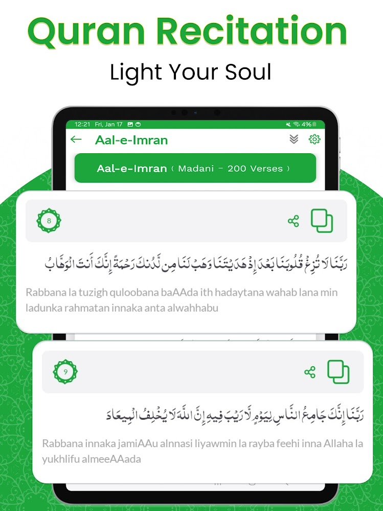
  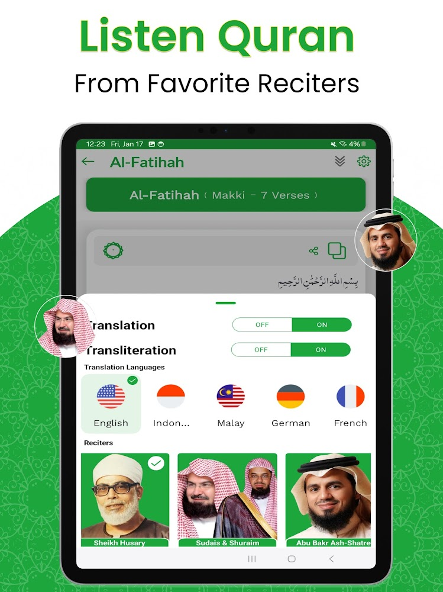
  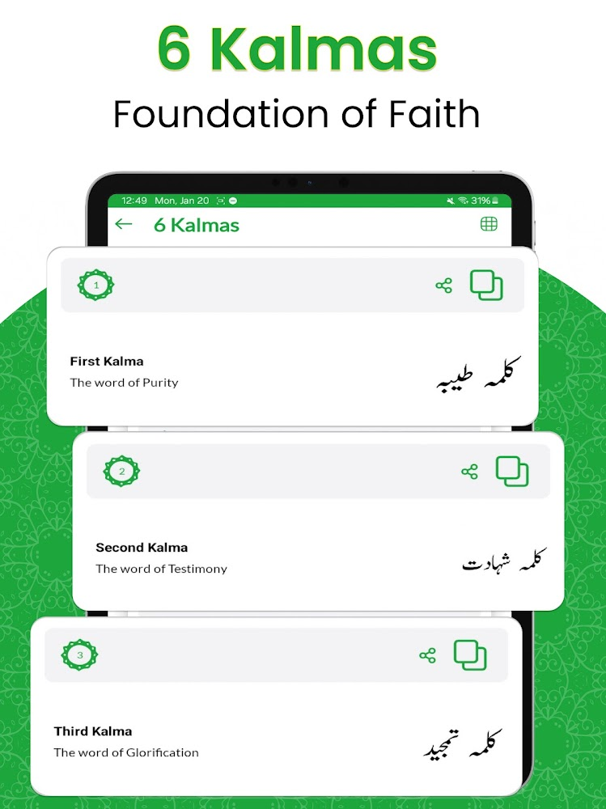

## 🏢 Project Details
* **Role:** Lead Developer (Ground-up Java Architecture & Full-Stack Development)
* **Company:** Zeesoft Tech
* **Availability:** Available on the Google Play Store (**50K+ Downloads**), [**Download Now**](https://play.google.com/store/apps/details?id=com.awami.alquran.holyquran.quran)